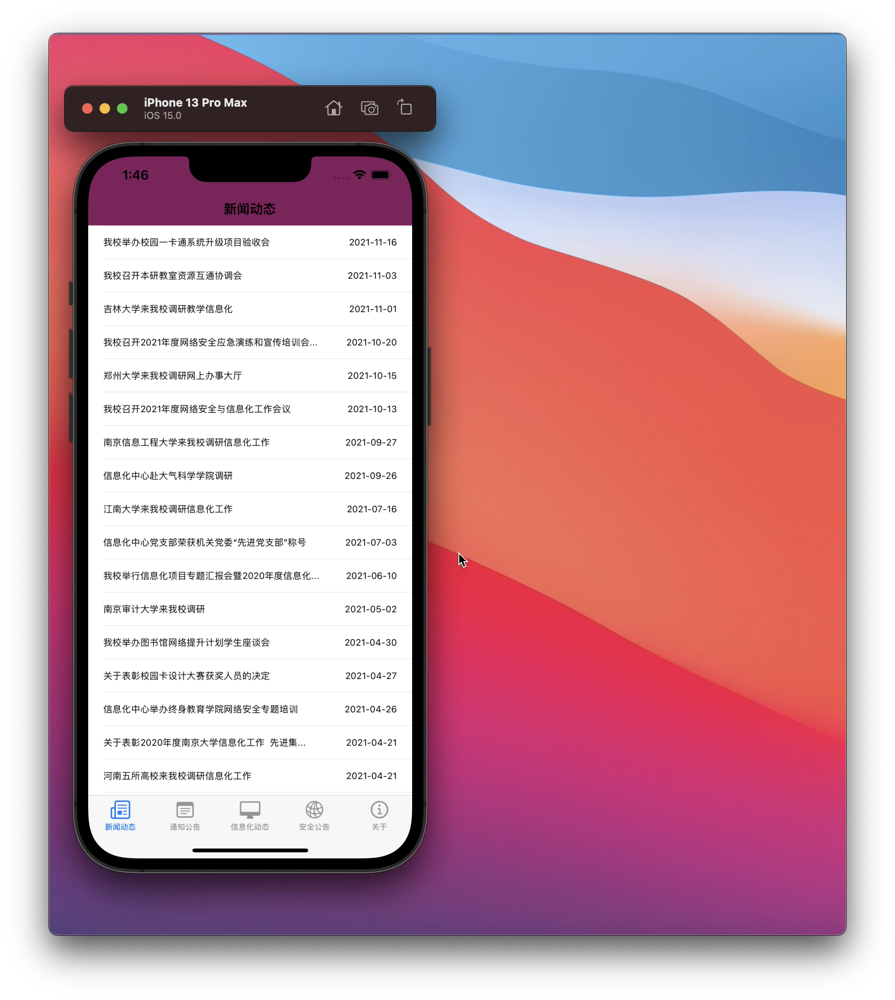
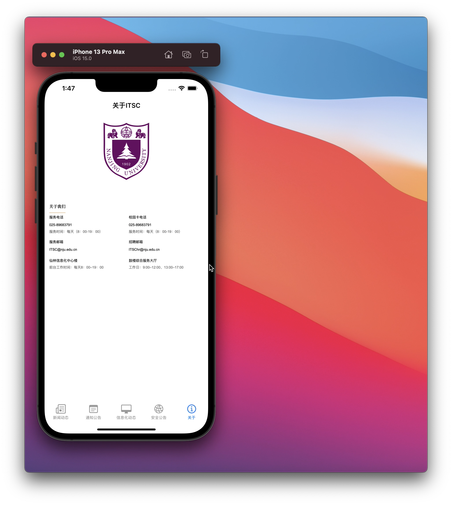

# IOSwork3 - NewsApp

#### 环境：macOS BIG SUR 11.6

#### Xcode版本：Version 13.0 (13A233)

#### 模拟器：iphone13 pro max (ios15.0)

## 效果展示

**演示：已经上传到群里**

### 开发历程记录

- 首先拿到这个项目的时候发现对HTML解析一头雾水，前期花了挺多时间在查找如何使用swift方便的解析HTML文件（虽然但是，最后还是使用了暴力解析标签的做法）
- 在解析好新闻条目后开始进行详细页面的开发。发现直接截断content段的做法得到的页面比较的丑陋，后来又通过暴力的方法加判断获得了一个拥有样式的界面。但是出现了一个比较大的问题，使用了类似电脑端浏览器显示的html的代码后，模拟器的详情页打开也是按照电脑的模式。期间对CSS和meta的属性进行过修改，但是要不就是能显示图片但是页面不听要求仍然按电脑端界面显示；要不就是宽度符合手机端但是无法显示图片。折腾了很久之后终于意识到——手机端的html代码是不是不一样。然后把代码修改成手机端的CSS和加上了获取设备宽度的JS代码后获得了相对来说还可以的详情界面。
- 但是最后信息化动态条目的详情界面显示仍然超出屏幕。处理了一段时间后我用手机尝试打开了这个分栏的详细，然后惊奇的发现——手机端访问它就是会超界。。。然后再看了下发现这个栏目的详情界面用的CSS代码、字体、还有每块的分区等都和其他的有差别。我用暴力法不好对他进行改造，于是我放弃了。